SELECT * FROM sales;

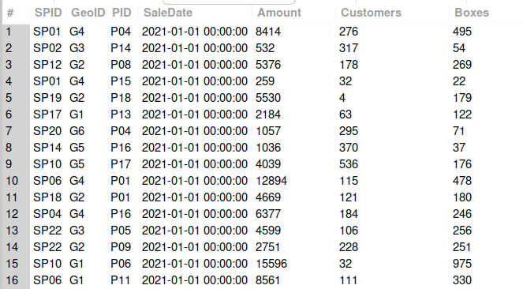

SELECT SaleDate, Amount, Customers FROM sales;

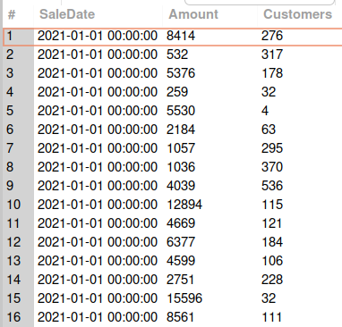

SELECT Amount,Customers,GeoID FROM sales;

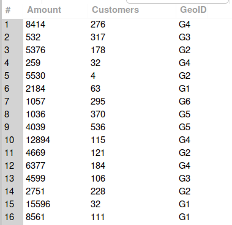

SELECT SaleDate, Amount, Boxes, Amount/Boxes FROM sales;

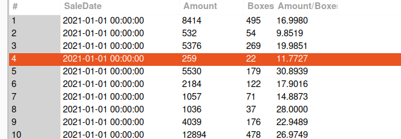

SELECT SaleDate , Amount, Boxes, Amount / boxes as 'Amount per box' from sales;

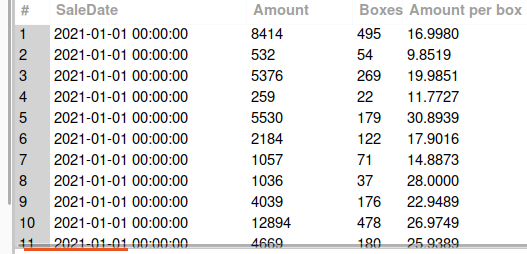

SELECT * FROM sales
WHERE amount > 20000 LIMIT 10;

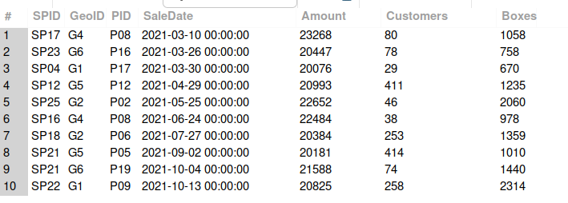

SELECT * FROM sales
WHERE boxes > 0 AND boxes <= 50 LIMIT 10;

SELECT * FROM sales 
WHERE boxes BETWEEN 0 AND 50 LIMIT 10;

ABove Both Conditions or Queries Are Applicable 

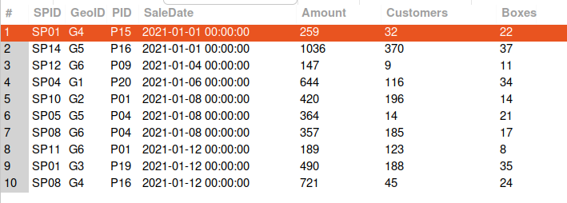

-- WEEKDAY() FUNCTION

SELECT SaleDate, Amount, Boxes, weekday(SaleDate) AS 'Day of Week'
FROM sales  WHERE weekday(SaleDate) = 4;

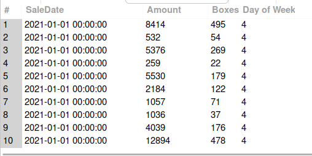

-- New Table
SELECT * FROM people;

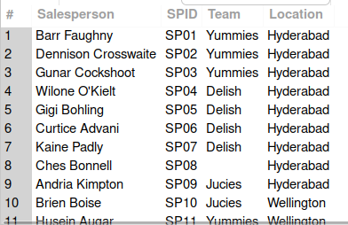

-- TEAM DELISH OR JUCIES
SELECT * FROM people
WHERE team = 'Delish' OR team = 'Jucies' LIMIT 10;

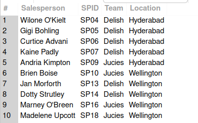

SELECT * FROM people 
WHERE salesperson LIKE 'B%';

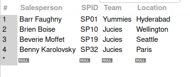

SELECT * FROM people 
WHERE salesperson LIKE '%B%' LIMIT 10;

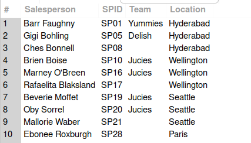